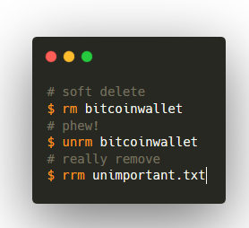

## Installation

Put this in your `~/.bashrc` or `/etc/profile`:

```bash
trash=~/.trash
  [[ ! -d $trash ]] && mkdir $trash
  rm(){   rmusage "$@" || mv "$1" $trash/.; }
  rrm(){  rmusage "$@" || $(which rm) -r "$@"; }
  unrm(){ mv $trash/"$1" . && echo restored $(pwd)/$1 || echo could not restore from $trash; }
  rmusage(){ [[ -n "$1" ]] && return 1 || {
          echo -e "usage:
          rm   <file_or_dir>        # move to trash
          rrm  <file_or_dir>        # real remove (using $(which rm))
          unrm <file_or_dir>        # restore"
          return 0
      }
  }
```

## Usage

```
$ rm
usage:
                rm   <file_or_dir>        # move to trash
                rrm  <file_or_dir>        # real remove (using /bin/rm)
                unrm <file_or_dir>        # restore

```

## Why

UX baby!


